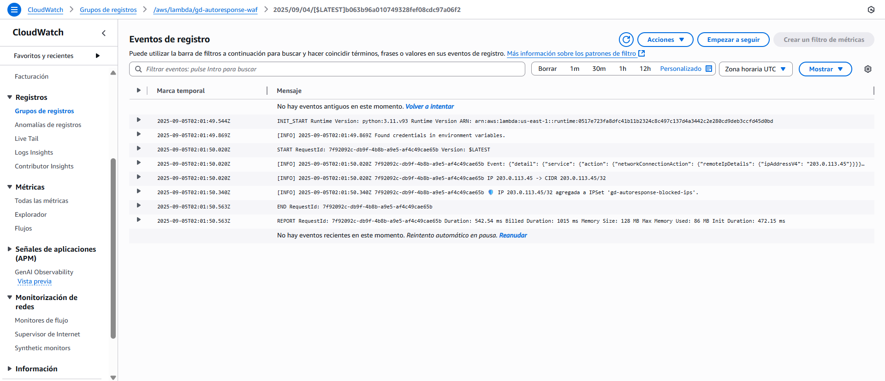
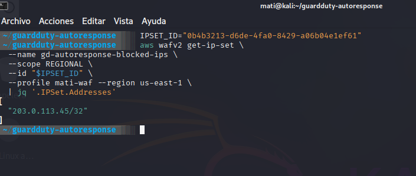
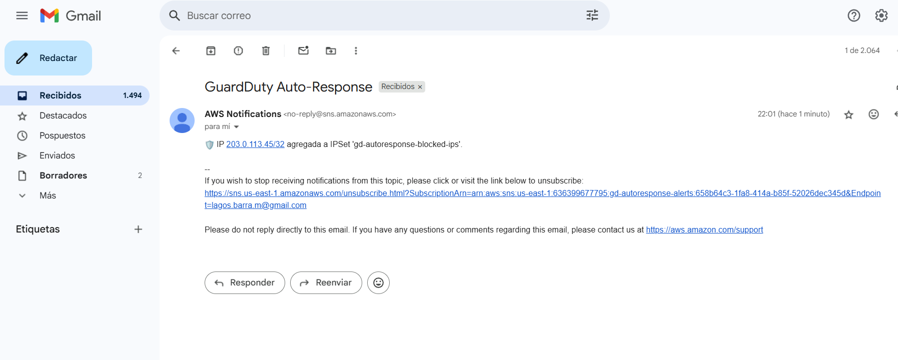

# 🛡️ AWS GuardDuty Auto-Response with WAF + Lambda + SNS

## 🚀 Overview
This project implements an **automated incident response pipeline in AWS**:
- GuardDuty detects malicious activity (e.g., suspicious connections, brute force).
- EventBridge triggers a Lambda function.
- The Lambda function automatically:
  - Extracts the attacker IP.
  - Updates an AWS WAFv2 IPSet to block the IP.
  - Sends an SNS notification (email alert).

✅ Demonstrates a **SOAR-like (Security Orchestration, Automation and Response)** workflow using serverless and IaC.

---

## 🏗️ Architecture

```text
[GuardDuty] --> [EventBridge Rule] --> [Lambda Function] --> [WAFv2 IPSet]
                                                      ↘
                                                        [SNS Email Alerts]

Terraform → Infrastructure as Code (SNS, WAF, Lambda, IAM).

Lambda (Python 3.11) → logic for blocking IPs + notifications.

SNS → email alerts.

WAF → automatic IP blocking.

⚙️ Deployment

1. Clone repository

git clone https://github.com/Matiaslb14/guardduty-autoresponse.git
cd guardduty-autoresponse/terraform

2. Initialize & validate

terraform init
terraform validate

3. Apply

terraform apply -auto-approve \
  -var alert_email="youremail@example.com" \
  -var aws_region="us-east-1" \
  -var aws_profile="your-aws-profile" \
  -var waf_scope="REGIONAL"

Confirm the subscription email from AWS SNS.

🧪 Testing

Manual Test (without GuardDuty)

You can simulate an event to validate the Lambda function:

aws lambda invoke \
  --function-name gd-autoresponse-waf \
  --payload fileb://event-test.json \
  --region us-east-1 \
  /tmp/out.json && cat /tmp/out.json

Check:

IP appears in the WAF IPSet.

Alert received by SNS email.

Logs in CloudWatch confirm execution.

With GuardDuty (once enabled)

DET=$(aws guardduty list-detectors --region us-east-1 --query 'DetectorIds[0]' --output text)
aws guardduty create-sample-findings --detector-id "$DET" --region us-east-1

📸 Evidence

## Evidence
<p align="center">
  
</p>

<p align="center">
  
</p>

<p align="center">
  
</p>

🔮 Next Steps / Improvements

Add DynamoDB TTL for temporary bans (auto-expire IPs after X hours).

Associate WAF Web ACL to ALB / API Gateway / CloudFront.

Multi-channel notifications (Slack / Teams).

Add automated tests with pytest for Lambda.

📚 Skills Demonstrated

AWS Security: GuardDuty, WAFv2, SNS, Lambda.

Automation: Python + Terraform (IaC).

Cloud Security Engineering: detection → response → notification.

SOAR mindset: automated incident response pipeline.

👨‍💻 Author

Matías Lagos


